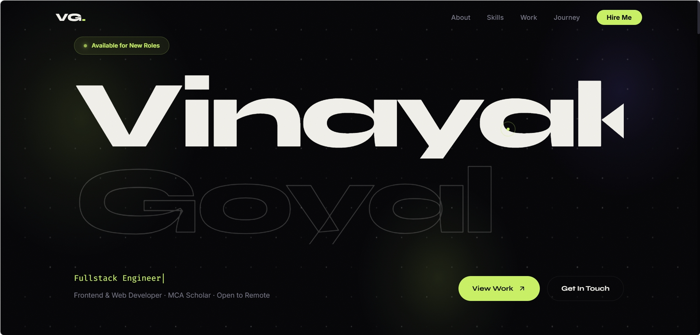

# Vinayak Goyal — Personal Portfolio Website



A high-performance, motion-first developer portfolio website built with HTML5, CSS3, JavaScript (ES6+), and GSAP + ScrollTrigger. Designed with an editorial dark aesthetic, fluid typography, interactive canvas graphics, and zero scroll desync.

Live Site: [Click Here](https://vinayakgoyal2208.github.io/Vinayak-portfolio/)

---

## ✨ Key Features

- **⚡ Native Scroll Performance (Zero Desync):** Driven strictly by native browser scrolling with GSAP ScrollTrigger for smooth, frame-perfect animations.
- **🎨 Editorial Dark Glass Aesthetics:** Electric lime (`#c8f065`) & indigo (`#7c6aff`) accents set against an obsidian theme (`#050508`) with a subtle grain texture overlay.
- **🌌 Interactive Hero Canvas:** Dynamic canvas background featuring floating glow orbs and an animated grid mesh.
- **🧲 Magnetic CTAs & Custom Cursor:** Interactive buttons that track mouse movement with spring physics and an adaptive dual-ring custom cursor.
- **🗂️ Interactive Work Showcase:** Filterable 9-project gallery with category tags (Internship, Fullstack, Personal) and hover overlays.
- **📈 Animated Skill Bars & Timeline:** Scroll-triggered proficiency bar fills and a dual-color experience timeline.
- **✉️ Working Contact Form:** Integrated AJAX contact form powered by FormSubmit that sends messages directly to `vinayakgoyal2208@gmail.com`.
- **📱 Fully Responsive:** Adaptive mobile navigation drawer and responsive grids for seamless viewing across mobile, tablet, and desktop screens.

---

## 🛠️ Tech Stack

- **Core:** HTML5, CSS3, Vanilla JavaScript (ES6+)
- **Animation & Motion:** [GSAP 3.12.5](https://greensock.com/gsap/), [ScrollTrigger](https://greensock.com/scrolltrigger/)
- **Typography:** [Syne](https://fonts.google.com/specimen/Syne), [Inter](https://fonts.google.com/specimen/Inter), [Fira Code](https://fonts.google.com/specimen/Fira+Code)
- **Form Backend:** [FormSubmit AJAX API](https://formsubmit.co/)

---

## 📂 Project Structure

```text
portfolio/
├── index.html          # Main HTML structure
├── style.css           # Custom CSS design system & component styles
├── script.js           # GSAP timelines, ScrollTrigger & canvas logic
├── assets/             # Project screenshots & media mockups
│   ├── project1.jpg
│   ├── project2.jpg
│   ├── project3.jpg
│   └── project4.jpg
└── README.md           # Project documentation
```

---

## 🚀 Quick Start / Local Setup

1. **Clone the repository:**
   ```bash
   git clone https://github.com/VinayakGoyal2208/portfolio.git
   cd portfolio
   ```

2. **Run locally:**
   Simply open `index.html` directly in your browser or use a local dev server:
   ```bash
   # Using VS Code Live Server extension, or python:
   python -m http.server 8000
   ```
   Navigate to `http://localhost:8000`.

---

## 📬 Contact Form Configuration

The contact form uses [FormSubmit](https://formsubmit.co/). 
- Upon the **very first form submission** on a new deployment, FormSubmit sends a single confirmation link to `vinayakgoyal2208@gmail.com`.
- Click **"Activate Form"** in that email once, and all future visitor submissions will automatically land in your inbox.

---

## 👤 Author

**Vinayak Goyal**
- **Role:** Frontend & Web Developer | MCA Scholar
- **GitHub:** [@VinayakGoyal2208](https://github.com/VinayakGoyal2208)
- **LinkedIn:** [Vinayak Goyal](https://www.linkedin.com/in/vinayak-goyal-888814221/)
- **Email:** vinayakgoyal2208@gmail.com

---

## 📄 License

This project is open source under the [MIT License](LICENSE).
